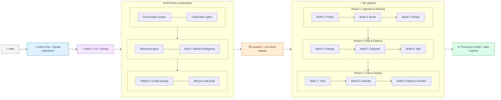

# AIConnex Master Technical Architecture Diagram
## Mermaid Diagram Reference Document

```mermaid
flowchart LR
    USER["👤 User"] --> UI["💬 React chat + upload experience"]
    UI --> CUC["📄 Intent / CUC contract"]
    
    subgraph ORCH["⚙️ AIConnex orchestrator"]
        direction TB
        subgraph R1[" "]
            direction LR
            A1["Conversation parser"] --- A2["Clarification agent"]
        end
        subgraph R2[" "]
            direction LR
            A3["Planning engine"] --- A4["Scout / dataset intelligence"]
        end
        subgraph R3[" "]
            direction LR
            A5["Platform / model training"] --- A6["Memory and audit"]
        end
        R1 --> R2 --> R3
    end
    
    CUC --> ORCH
    ORCH --> DIC["🗄️ Compiler + canonical dataset"]
    
    subgraph MLP["🔬 ML pipeline"]
        direction TB
        subgraph M1["Phase 1: Ingestion & Routing"]
            direction LR
            N1["Node 1: Profile"] --> N2["Node 2: Route"] --> N3["Node 3: Recipe"]
        end
        subgraph M2["Phase 2: Prep & Feature"]
            direction LR
            N4["Node 4: Prepare"] --> N5["Node 5: Engineer"] --> N6["Node 6: Split"]
        end
        subgraph M3["Phase 3: Train & Deploy"]
            direction LR
            N7["Node 7: Train"] --> N8["Node 8: Evaluate"] --> N9["Node 9: Deploy & Monitor"]
        end
        M1 --> M2 --> M3
    end

    DIC --> MLP
    MLP --> OUT["✅ Production model + data explorer"]

    classDef user fill:#f5f5f4,stroke:#78716c,color:#1c1917;
    classDef ui fill:#e0f2fe,stroke:#0284c7,color:#0c4a6e;
    classDef contract fill:#f3e8ff,stroke:#9333ea,color:#581c87;
    classDef comp fill:#ffedd5,stroke:#ea580c,color:#7c2d12;
    classDef prod fill:#dcfce7,stroke:#16a34a,color:#14532d;

    class USER user;
    class UI ui;
    class CUC contract;
    class DIC comp;
    class OUT prod;
```
