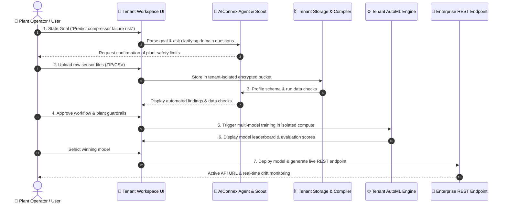

# Slide 10: Multi-Tenant Customer Journey Sequence Diagram
## AIConnex Technical Reference Document

```mermaid
sequenceDiagram
    autonumber
    actor User as 👤 Plant Operator / User
    participant UI as 🏢 Tenant Workspace UI
    participant Agent as 🧠 AIConnex Agent & Scout
    participant Storage as 🗄️ Tenant Storage & Compiler
    participant Engine as ⚙️ Tenant AutoML Engine
    participant API as 🚀 Enterprise REST Endpoint

    User->>UI: 1. State Goal ("Predict compressor failure risk")
    UI->>Agent: Parse goal & ask clarifying domain questions
    Agent-->>User: Request confirmation of plant safety limits
    User->>UI: 2. Upload raw sensor files (ZIP/CSV)
    UI->>Storage: Store in tenant-isolated encrypted bucket
    Storage->>Agent: 3. Profile schema & run data checks
    Agent-->>UI: Display automated findings & data checks
    User->>UI: 4. Approve workflow & plant guardrails
    UI->>Engine: 5. Trigger multi-model training in isolated compute
    Engine->>UI: 6. Display model leaderboard & evaluation scores
    User->>UI: Select winning model
    UI->>API: 7. Deploy model & generate live REST endpoint
    API-->>User: Active API URL & real-time drift monitoring
```
