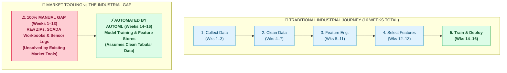

# Slide 4: Timeline & Market Gap Diagram Guide
## AIConnex Executive Pitch Deck — Visual Asset & Code Reference

---

> **Purpose**: This guide provides both the raw copy-pasteable Mermaid diagram code and the high-resolution rendered graphic for **Slide 4 ("Why Most AI Projects Stall Before They Even Start")**.

---

## 🖼️ 1. Rendered Visual Diagram

---

## 💻 2. Raw Mermaid Code (Copy & Paste Ready)

Use this raw text code in diagram editors such as **Eraser.io**, **Napkin AI**, **Mermaid Live Editor**, **Notion**, or **Canva App**:

---

## 📝 3. Slide 4 Content Summary

* **Header**: Why Most AI Projects Stall Before They Even Start
* **Subtitle**: Teams spend most of their time preparing data — and by the time the model is ready, the budget and patience are gone.
* **Key Message**: Existing market tools (Feature Stores & AutoML) automated the second half (*after data is clean*). AIConnex solves the hardest first half (*getting messy raw industrial data clean in the first place*).
