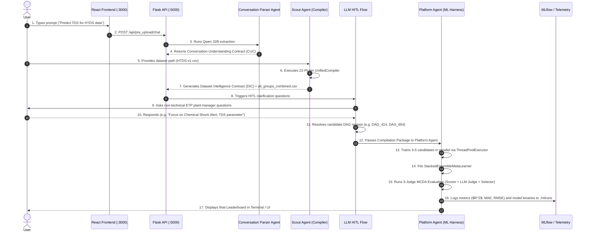
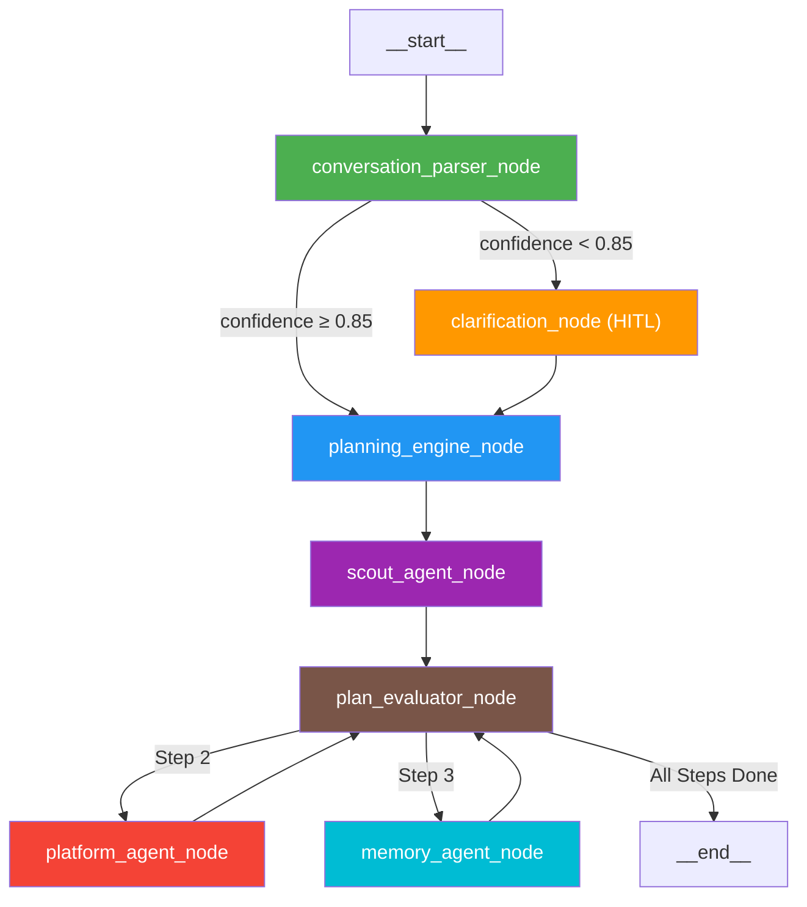

# AIConnex Master System Architecture & Execution Guide

---

## 1. High-Level Flow of the System

AIConnex is an **Agentic MLOps Platform**. It takes a user from a simple natural language conversation to fully trained, evaluated, and deployed Machine Learning models.

### The 5-Phase High-Level Journey

```
 ┌────────────────┐     ┌────────────────┐     ┌────────────────┐     ┌────────────────┐     ┌────────────────┐
 │ Phase 1: Chat  │ ──► │ Phase 2: Scout │ ──► │ Phase 3: HITL  │ ──► │Phase 4:Platform│ ──► │ Phase 5: Result│
 │ Natural Language│    │ File Profiling │     │ Plant Manager  │     │ Parallel ML    │     │ Leaderboard &  │
 │ Intent Parsing │     │ & Compilation  │     │ Confirmation   │     │ Training & MCDA│     │ Model Export   │
 └────────────────┘     └────────────────┘     └────────────────┘     └────────────────┘     └────────────────┘
```

### Simple Factory Analogy
Think of AIConnex as an **Automated Custom Car Factory**:
1. **Phase 1 (The Receptionist)**: Asks what kind of car you want (e.g. speed, fuel efficiency, budget).
2. **Phase 2 (The Parts Inspector)**: Inspects the raw metals and engine parts you delivered (`HTDS-v1.csv`), measures quality, and cleans them.
3. **Phase 3 (The Workshop Manager)**: Asks you 2–3 final non-technical questions to confirm your preferences before building.
4. **Phase 4 (The Assembly Line)**: Builds 3 to 5 candidate engines in parallel (XGBoost, LightGBM, RandomForest), tests them on a racetrack, and combines the best parts into an Ensemble.
5. **Phase 5 (The Handover)**: Delivers the winner to you with a complete performance scorecard logged to MLflow.

---

## 2. Low-Level System Flow (Step-by-Step Data Execution)

Here is the exact data path from the moment the user types a prompt to the final model export.



### Granular Execution Steps

| Step # | Module / File | What Happens | Input Data | Output Data |
|---|---|---|---|---|
| **Step 1** | `chatbot/backend/extraction.py` | Extracts user intent and parameters using OpenRouter Qwen 32B. | User chat string | `cuc` JSON object |
| **Step 2** | `aiconnex_agent/planning/planning_engine.py` | Maps CUC intent to a 7-step execution plan sequence. | `cuc` contract | `plan_steps: List[TaskStep]` |
| **Step 3** | `aiconnex_zip_compiler/compiler.py` | Runs `UnifiedCompiler` auto-discovery probe (22 plugins) on raw file. | `HTDS-v1.csv` | `all_groups_combined.csv` + `dic` contract |
| **Step 4** | `chatbot/backend/hitl_flow.py` | Executes LLM-driven non-technical HITL prompt loop. | User business preferences | `hitl_contract.json` + `resolved_dag_pool` |
| **Step 5** | `aiconnex_agent/platform/multi_dag_resolver.py` | Queries `dag_conditions_mapping.json` (1,993 DAGs) for 3–5 distinct algorithms. | `HITLContract` | `List[CandidateRecipe]` |
| **Step 6** | `aiconnex_agent/platform/platform_node.py` | Spins up `ThreadPoolExecutor` to train base candidates in parallel. | `CandidateRecipe[]` | Trained model binaries + predictions |
| **Step 7** | `aiconnex_ml/regression/trainer.py` | Fits `StackedEnsembleMetaLearner` combining predictions. | Base model predictions | Stacked Meta-Learner Model |
| **Step 8** | `aiconnex_agent/platform/evaluation/` | Runs MCDA Evaluation Triad (50% Scorer + 30% LLM Judge + 20% Intent). | Models + Metrics | `SelectionResult` Winner |
| **Step 9** | `aiconnex_agent/telemetry/emitters.py` | Logs parameters, metrics, and manifest artifacts to MLflow. | `SelectionResult` | `./mlruns` experiment record |

---

## 3. Agentic Architecture & How Agents Work

The system uses a **State-Driven Multi-Agent Architecture** orchestrated by **LangGraph**. Responsibility is divided among 7 specialized agents.

### LangGraph Topology Diagram



### Core Architectural Rules

1. **State-Driven Functional Nodes**: Each agent node is a pure function:
   $$\text{node\_output} = f(\text{MasterAgentState})$$
   Agents receive the complete master state dictionary, modify only their specific keys, and return the updated state.
2. **Decoupled Edge Routing**: Agents do **not** call other agents directly. The LangGraph engine inspects state flags (like `confidence_score` or `current_step_index`) to determine which node runs next.
3. **Human-in-the-Loop (HITL) Interrupts**: When an agent needs human input (e.g. strategy choices or clarifying questions), it invokes LangGraph's `interrupt()` function. The graph **pauses synchronously**, saves a checkpoint to disk, and waits for user input before resuming seamlessly.
4. **Session Correlation ID**: Every session generates an immutable `session_id` (`wf_<hex8>`). All output directories, MLflow runs, event logs, and dataset exports are tied to this correlation ID.

---

## 4. The 3-Layer Manifest Architecture

To make AIConnex auditable and reproducible, state is organized into **3 Manifest Layers** that feed into a final **Compilation Package**:

```text
1. CONVERSATION MANIFEST LAYER
   ├── Conversation History
   ├── User Intent & Constraints
   └── Conversation Understanding Contract (CUC)
            │
            ▼
2. DISCOVERY MANIFEST LAYER
   ├── File Inventory & Upload Metadata
   ├── Schema Manifest & Data Types
   ├── Quality Manifest (Missing, Outliers, Skew)
   └── Dataset Intelligence Contract (DIC)
            │
            ▼
3. DECISION MANIFEST LAYER
   ├── HITL Operational Preferences (Goal, Target, Sensitivity)
   ├── Candidate Recipe Manifests (DAG_414, DAG_654)
   └── Execution Approval Sign-off
            │
            ▼
┌─────────────────────────────────────────────────────────────┐
│                 COMPILATION PACKAGE                         │
│  (The single standardized folder handed off to Phase 2)     │
│  ├── conversation_manifest.json                             │
│  ├── discovery_manifest.json                                │
│  ├── decision_manifest.json                                 │
│  └── all_groups_combined.csv                                │
└─────────────────────────────────────────────────────────────┘
```

### Summary of Manifest Layers
- **Conversation Layer**: Understands *what the user wants*.
- **Discovery Layer**: Understands *what the dataset contains*.
- **Decision Layer**: Understands *how the plant manager wants the model built*.
- **Compilation Package**: The complete, immutable handoff payload consumed by the Platform Agent to execute training without human intervention.
