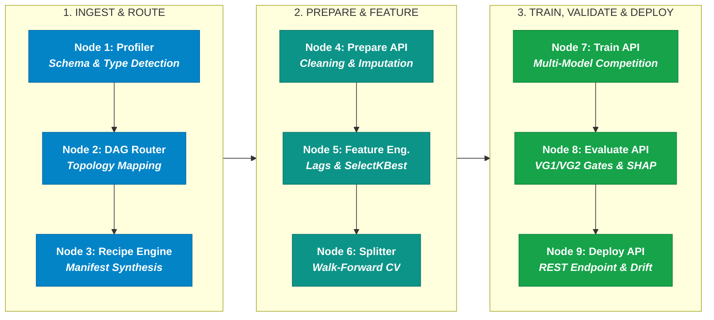

# AIConnex Core ML Pipeline Architecture
## 9-Node Microservice DAG Pipeline — Executive Presentation Reference

---

> **Purpose**: This document provides the high-resolution visual graphic, raw Mermaid diagram code, and presentation copy for showcasing AIConnex's **9-Node Microservice DAG ML Pipeline** in client, investor, and executive presentation decks.

---

## 🖼️ 1. Rendered Visual Architecture Diagram

---

## 💻 2. Raw Mermaid Diagram Code (Copy-Paste Ready)

Use this raw text code in diagram tools like **Eraser.io**, **Napkin AI**, **Mermaid Live Editor**, **Notion**, or **Canva App**:

---

## 📋 3. Slide Content & Presenter Guide

### **Slide Title**
> **Core Architecture: 9-Node Microservice ML Pipeline**

### **Subtitle**
> Fully Decoupled, Modular DAG Execution Engine Built for Scale and Auditability

---

### **On-Slide Content (3 Microservice Clusters)**

#### 1. Ingestion & Intelligent Routing (Nodes 1–3)
* **Dataset Profiler**: Automatic schema inference, missingness auditing, and data type detection.
* **DAG Orchestrator**: Dynamically maps task requirements to optimal algorithm topologies (`DAG_120`, `DAG_491`, `DAG_595`).
* **Recipe Orchestrator**: Generates deterministic transformation recipes and hyperparameter manifests.

#### 2. Data Preparation & Feature Engineering (Nodes 4–6)
* **Prepare API**: Automated time-series indexing, missing value imputation, and outlier treatment.
* **Feature Engineering API**: Lag/rolling sensor generation and `SelectKBest` feature selection.
* **Split API**: Native 5-fold walk-forward expanding window cross-validation splitter.

#### 3. Parallel Training, Validation & Deployment (Nodes 7–9)
* **Train API**: Multi-model competition evaluating XGBoost, LightGBM, CatBoost, RandomForest, Neural Nets, and H2O AutoML.
* **Evaluate API**: Strict VG_1 Data Quality Gate, VG_2 Advisory Overfit Gate, and SHAP explainability.
* **Deploy & Monitor API**: One-click REST API generation with real-time sensor drift monitoring.

---

### 🎙️ Presenter Talking Points
> *"Under the hood, AIConnex is powered by a 9-node DAG microservice architecture. Each node operates as an isolated, scalable service—from automated schema profiling and time-series feature engineering to multi-algorithm model competition, strict quality validation gates, and one-click REST API deployment. This modularity ensures zero technical debt, total auditability, and enterprise-grade reliability."*
